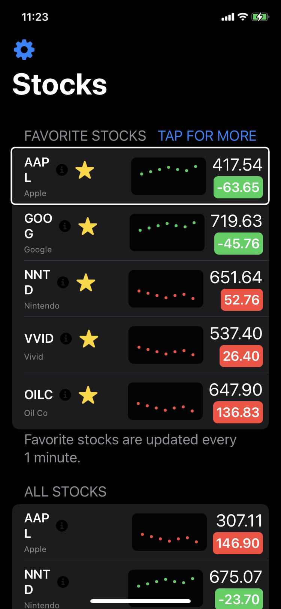
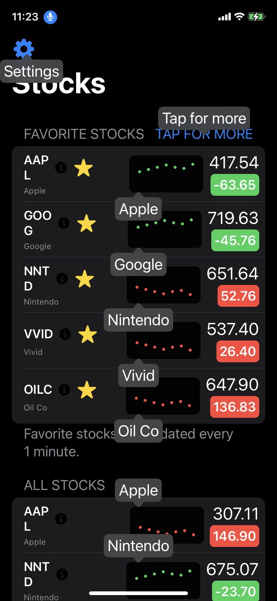

# InAccessibility
A SwiftUI app that's not very accessible... On purpose

This app is part of the [Accessibility](https://www.swiftuiseries.com/accessibility) event during the SwiftUI Series. This project has been made inaccessible and non-inclusive on purpose. Can you fix the 20+ areas that can be improved?

## Improvements

This was a really fun challenge! Here are some of the changes that I made. 

### VoiceOver

- Each stock cell is read aloud naturally in dollars and cents.
- Hint to tap for more info.
  - Tapping the cell brings up the detail view with a close button. Otherwise, VoiceOver users cannot dismiss the sheet.

https://user-images.githubusercontent.com/7575395/170692481-ee7ef1e3-93e1-4a85-b38c-6a60f74837de.mov

- 

### Voice Control
- Each stock cell is tappable via Voice Control.
- 

### Future Improvements
- Next time, I would try to fix the info button. Currently, it is not tappable with Voice Control unless you say, "show grid."
- I'll also research Dynamic Type. Even though the challenge has ended, I'll continue looking into how to improve the app for those with low vision.

